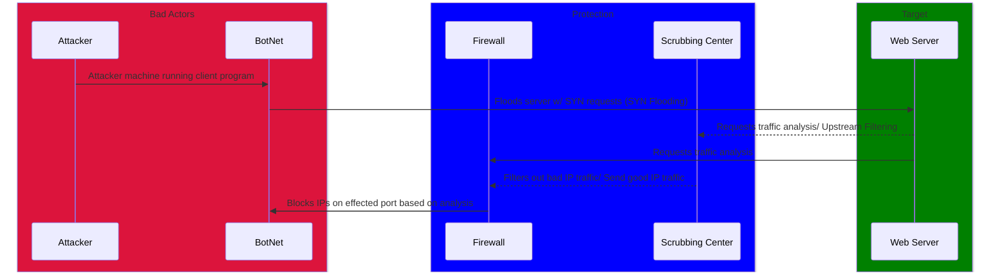

 # Breakdown

 ## Entities

 - **Attacker:** A malicious actor who is performing the DDoS Attack
 - **Bot Network (BotNet):** A group of interconnected devices that runs an independent, malicious bot
 - **Web Server:** An internet server that is hosting web services (website, forum, etc.)
  - **Scrubbing Center:** A facility/service that monitors and analysis incoming network traffic
 - **Firewall:** An intermediate software device/program that monitors and controls incoming/outgoing network traffic

 ## Terms

- _Distributed Denial of Service(DDoS) Attack:_ A type of cyber attack on a web server wherein a malicious actor uses several infected computers to stop legitimate requests to the server 
 - _SYN request:_ A message sent from a client machine to a server to initiate a TCP connection.

 ## Sequence of Events

**pre-requisite:** The attacker has sent out malware to infected computers that has the IP address of the Web Server hard-coded into the malware. (Zombification)

1) The **Attacker** sends out a signal to all of the bots connected to their botnet.
2) The each bot in the **BotNet** receives the signal and floods the the web server with _SYN requests_.
3) The **Web Server** passes all of the _SYN Requests_ traffic to the **FireWall**, or optionally a **Scrubbing Center**, for analysis.
4) The **Firewall** / **Scrubbing Center** filters out all bad incoming network traffic based off of patterns, originating IP Addresses, and port being accessed.
5) In the case of a **Scrubbing  Center**, all remaining network traffic, along with a traffic analysis, is sent to the **Firewall** for further filtering.